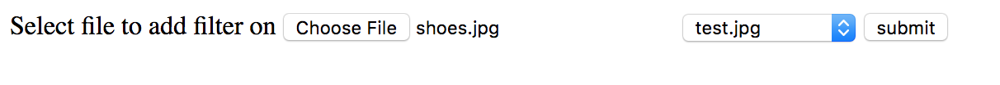
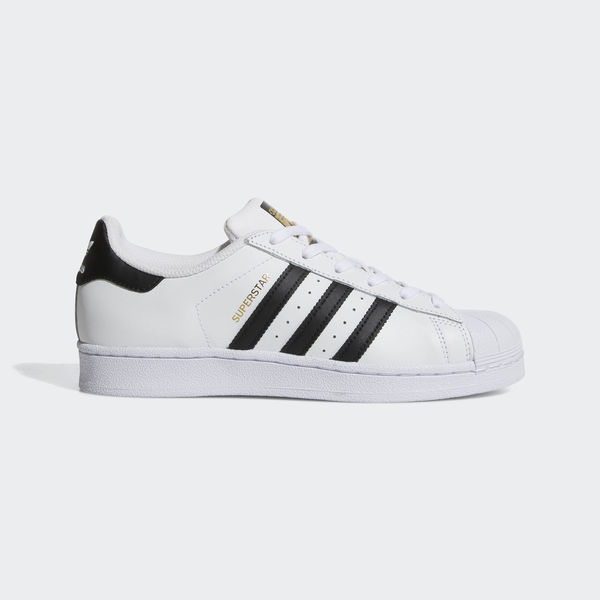
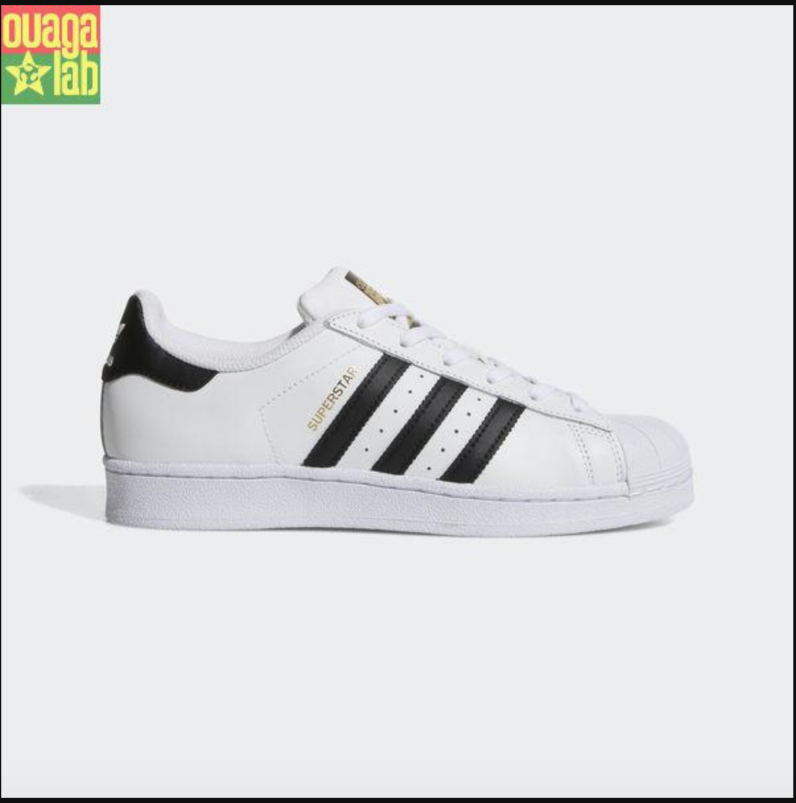

# Facebook-Filter-on-image
Simple image merging using php (ajout de filtre sur image avec php 

# DEMO
-  Interface 
 
- Destination image (l'image sur laquelle nous voulons ajouter le filtre

 
 
 - Filter (le Filtre)
 
 
 
 - Result (Le resultal )
 
 
 
 # Installation
 
 `$ git clone https://github.com/digits21/Facebook-Filter-on-image.git`
 
 
 
 # Contribution 
 
 Fork and enjoy coding .
 
 # Special Thanks to 
 - ## [Ouagalab](https://www.fablabs.io/labs/ouagalab)
 
 - ## [Opendarasa](https:://www.opendarasa.com)
